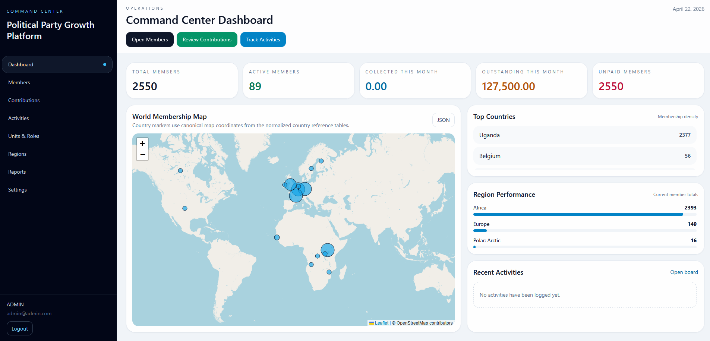
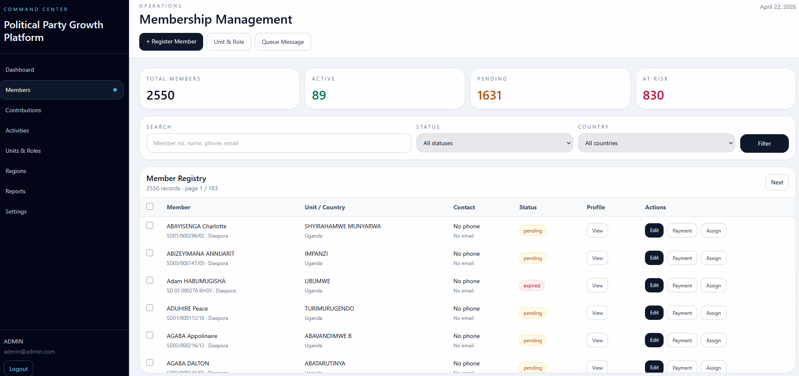
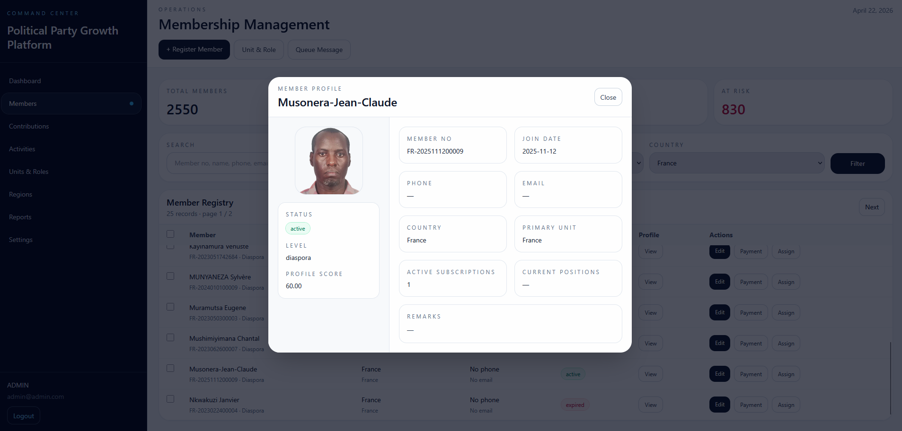
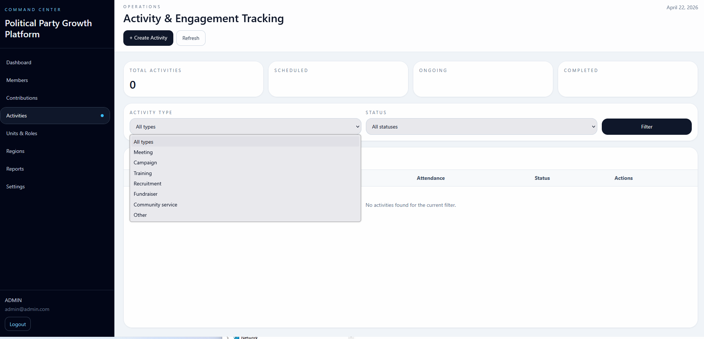
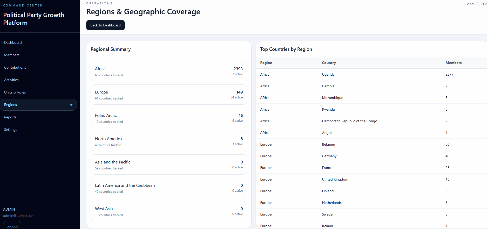
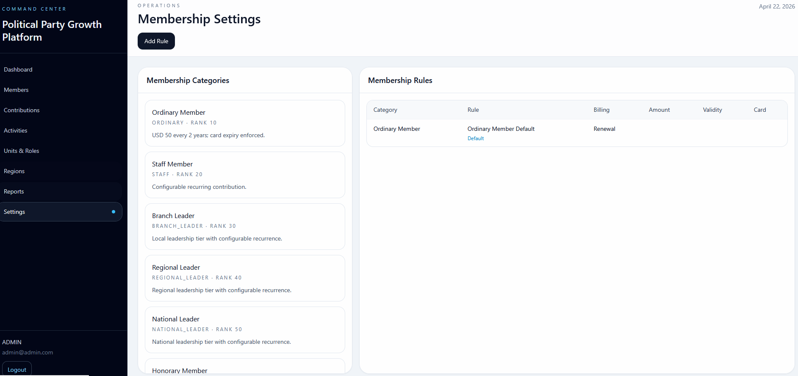
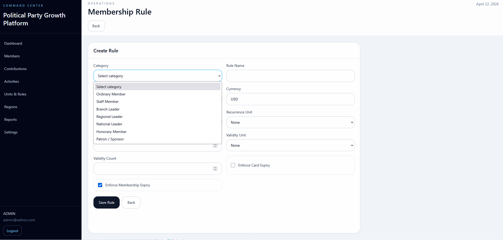

# 📈 Membership Campaign Platform

A scalable **organizational membership and campaign management system** designed for structured user management, engagement tracking, and operational workflows.

---

## 🚀 Overview

This platform provides a centralized system for:

* membership lifecycle management
* campaign and activity coordination
* contribution and engagement tracking
* geographic and organizational structuring
* administrative control and reporting

---

## 🖥️ Command Center Dashboard



* real-time operational overview
* member statistics and activity tracking
* global distribution visualization (map-based)
* contribution insights

---

## 👥 Membership Management



* full member registry system
* search, filtering, and segmentation
* status tracking (active, pending, expired)
* role and unit assignment

---

## 👤 Member Profile System



* structured member identity view
* subscription and activity tracking
* geographic and organizational mapping
* profile scoring system

---

## 📊 Activity & Engagement Tracking



* campaign and activity management
* scheduling and lifecycle tracking
* categorized engagement types
* operational monitoring

---

## 🌍 Regions & Geographic Coverage



* region-based membership aggregation
* geographic distribution insights
* country and regional analytics
* structured data visualization

---

## ⚙️ Membership Settings & Rules





* configurable membership categories
* rule-based membership logic
* recurring contribution setup
* expiration and validation controls

---

## 🧠 Architecture

Frontend Dashboard
→ PHP Backend APIs
→ Business Logic Layer
→ MySQL Database

Core Modules:

* Members
* Campaigns / Activities
* Contributions
* Regions
* Rules Engine

---

## ⚙️ Tech Stack

* PHP (Backend)
* JavaScript (Frontend)
* MySQL (Database)
* RESTful API design

---

## ⚡ Key Engineering Highlights

* designed a **modular membership management system**
* implemented **role-based and hierarchical data modeling**
* built **activity and campaign tracking workflows**
* created **rule-driven membership engine**
* integrated **geographic data visualization (map-based UI)**
* structured scalable backend APIs for maintainability

---

## ⚠️ Configuration

This repository is a **sanitized public version**.

* no real organizational data included
* no credentials or secrets exposed

Use:

```bash
config/example.env
```

to configure locally.

---

## 📌 Purpose

This project demonstrates:

* backend system architecture
* complex data modeling
* administrative system design
* scalable business logic implementation

---

## 🔐 Disclaimer

This project is intended for **technical demonstration purposes only**.

It uses generic or simulated data and is not affiliated with any real organization or entity.

---

## 👤 Author

**Stephen Kaihula**
Full Stack Systems Engineer

---


